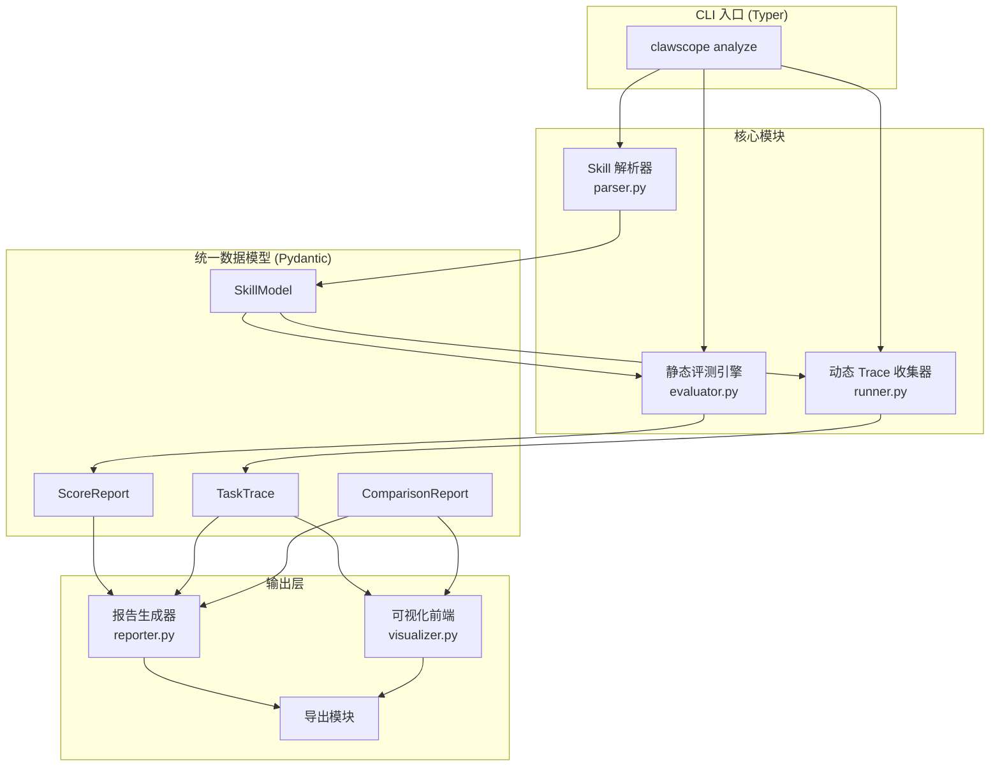
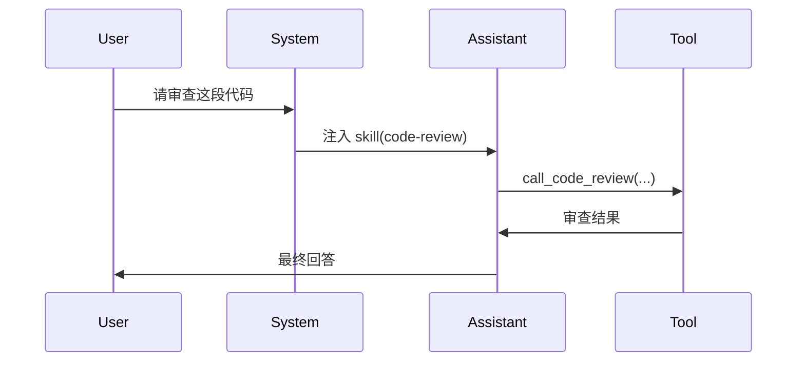
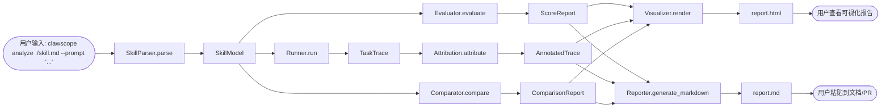

# OpenClaw Skill 评测与可视化工具

## 一、问题背景与要解决的问题

### 1.1 背景

随着 AI Agent 框架的普及，**Skill（技能）** 成为扩展 Agent 能力的核心机制。无论是OpenClaw、Claude Code 还是 Cursor，都允许开发者编写 Markdown 格式的 Skill 文件，定义触发条件、工具调用和推理指引。然而，Skill 的开发目前高度依赖直觉和经验——写完之后只能靠“跑一次试试”来判断好坏，缺乏系统性的验证手段。作为OpenClaw 的 Skill 开发者，在实践中经常遇到以下痛点：

- **静态质量不可知**：写了一个 `SKILL.md`，不知道它的结构是否完整、描述是否清晰、是否存在安全隐患。只能肉眼扫一遍，容易遗漏。
- **运行时行为黑盒**：Skill 在 Agent 推理过程中是否真的被触发？触发了多少次？占了多少 token？对最终回答产生了多大影响？这些信息隐藏在冗长的日志里，难以直观把握。
- **效果无法量化**：一个 Skill 到底“有用”还是“没用”？相比不用 Skill，它能节省多少 token、提升多少回答质量？没有对照实验，只能凭感觉判断。
- **调试效率低**：每次修改 Skill 后，需要手动启动网关、输入测试 prompt、翻看终端输出，流程繁琐，且无法保留历史对比。

### 1.2 要解决的问题

**ClawSkillScope** 旨在为 OpenClaw 的 Skill 开发者提供一套**闭环的评测与可视化工具**，解决以下三个核心问题：

1. **静态质量评估**：自动分析 Skill 文件的结构、描述清晰度、安全性、规范性和可复用性，给出量化评分和改进建议，让开发者一眼知道 Skill 的“健康度”。
2. **动态行为可视化**：通过零侵入的方式捕获 Agent 推理过程中的每一步（思考、工具调用、结果），并以图形化时间线展示，清晰标注 Skill 在何处被注入、产生了什么影响。
3. **效果量化对比**：自动执行“有 Skill vs 无 Skill”的对照实验，对比 token 消耗、耗时、回答质量等指标，用数据证明 Skill 的真实价值。

最终目标是让 Skill 开发从“盲人摸象”变为“数据驱动”，提升开发效率和 Skill 质量。

## 二、整体架构



## 三、模块职责与实现要点

### 3.1 Skill 解析器（`parser.py`）

**输入**：`SKILL.md`文件路径

**输出**：`SkillModel`（Pydantic 对象）

**核心逻辑**：

- 用 `PyYAML`解析 YAML frontmatter（`---`分隔的区域），提取 `name`, `description`, `trigger`, `tools`, `references`等字段
- 将 frontmatter 之后的部分作为 `body`（markdown 正文）
- 若 frontmatter 缺失，尝试从正文首段推断 `name`和 `description`
- 校验必填字段：`name`, `description`必须存在；若缺失，标记为警告但不中断

**数据结构（简化）**：

```python
class SkillModel(BaseModel):
    path: Path
    name: str
    description: str
    trigger: Optional[str] = None
    tools: List[str] = []
    references: List[str] = []
    body: str
    raw_frontmatter: Dict[str, Any]
    warnings: List[str] = []
```

### 3.2 静态评测引擎（`evaluator.py`）

**输入**：`SkillModel`

**输出**：`ScoreReport`（包含 5 维分数、总分、改进建议）

**评分维度与权重**（参考微软 SkillLens 论文 + 实际经验）：

| 维度       | 权重 | 核心检查项                                                   |
| ---------- | ---- | ------------------------------------------------------------ |
| 结构完整性 | 20%  | frontmatter 是否存在、字段是否齐全、body 是否有章节划分      |
| 描述清晰度 | 25%  | description 是否包含触发条件、目标、限制；是否避免歧义       |
| 安全性     | 15%  | 是否包含危险命令（rm -rf、curl 管道 shell 等）；是否限制工具权限 |
| 规范性     | 20%  | 命名是否一致、缩进格式、是否遵循 OpenClaw 最佳实践           |
| 可复用性   | 20%  | 是否依赖特定路径/环境变量；是否提供参数化配置                |

**评分方法**：

- **规则评分**：约 60% 分数来自静态规则（正则、关键词、字段长度检查等），保证稳定性和可解
- **LLM Judge**：约 40% 分数调用 GPT-4o-mini 或 DeepSeek-V3 对“描述清晰度”和“可复用性”做主观评分（提供评分标准 + few-shot 示例），返回 0-100 整数

**改进建议生成**：

- 每条扣分项对应一条建议，例如：“description 字段缺失触发条件，建议补充‘当用户请求代码审查时’”
- 使用 LLM 生成综合建议（可选）

### 3.3 任务运行器 + Trace 收集器（`runner.py`）

**输入**：测试 prompt（字符串）

**输出**：`TaskTrace`（包含完整消息序列、工具调用、耗时）

**实现方式**（零侵入，利用 OpenClaw 现有接口）：

- 通过 `subprocess`启动 OpenClaw 网关：`openclaw gateway --port 18789 --log-level debug`

- 等待网关就绪（轮询 `http://127.0.0.1:18789/health`）

- 发送 POST 请求到 `/chat/completions`（OpenAI-compatible 接口），携带测试 prompt

- 同时持续 GET `/debug`端点，获取最新的 trace 日志（JSON 格式）

- 解析 trace 日志，提取：

  - 每轮 LLM 调用的 `input`/ `output`/ `duration_ms`

  - 工具调用的 `tool_name`/ `arguments`/ `result`/ `duration_ms`
  - 系统 prompt 内容（用于后续 skill 命中归因）

- 任务结束后关闭网关进程

**关键设计**：

- 使用 `asyncio`并发处理请求和日志轮询，避免阻塞
- 设置超时（默认 120 秒），防止无限等待
- 支持 `--dry-run`模式：只打印 curl 命令，不实际执行

### 3.4 命中归因模块（`attribution.py`）

**输入**：`TaskTrace`+ `SkillModel`

**输出**：标注了 skill 注入点的 trace（每步标记是否受 skill 影响）

**算法**：

- 遍历 trace 中的 `system`消息（OpenClaw 会将 skill 正文注入到 system prompt 中）
- 检测 system prompt 中是否包含 `SkillModel.name`或 `SkillModel.description`的关键片段
- 若命中，记录该轮及后续若干轮（直到下一次 system prompt 刷新）为“受 skill 影响”
- 统计受影响的 token 数、轮次占比

**边界情况**：

- 多个 skill 同时命中时，分别标注（用逗号分隔）
- 若 skill 未在任何 system prompt 中出现，标记为“未命中”

### 3.5 对照实验模块（`comparator.py`）

**输入**：`SkillModel`+ 测试 prompt

**输出**：`ComparisonReport`（有/无 skill 的差异）

**流程**：

1. 正常执行一次（带 skill）
2. 临时将 skill 移出 workspace（或修改配置指向空目录），再执行一次相同 prompt
3. 对比指标：
   - Token 总数（input + output）
   - 总耗时
   - 工具调用次数
   - 回答质量（LLM as Judge：给两份回答打分，或直接输出 diff）
   - 是否出现错误/拒绝回答

**实现技巧**：

- 用 `tempfile.TemporaryDirectory`创建一个空 skill 目录，启动网关时传入 `--skill-dir`参数（OpenClaw 支持）
- 两次运行共享相同的对话历史前缀（如果有），确保公平

### 3.6 可视化前端（`visualizer.py`+ HTML 模板）

**输出**：单页 HTML 文件（无后端依赖）

**布局**（三栏）：

```
┌─────────────────────────────────────────────────────────────┐
│  [Skill 元数据]  [评分雷达图]  [改进建议]                   │  ← 左栏
├─────────────────────────────────────────────────────────────┤
│  时间线：                                              │  ← 中栏
│  Step 1: User → System (skill 注入)                        │
│  Step 2: Assistant → Tool (code_review)                    │
│  Step 3: Tool → Assistant (review result)                  │
│  Step 4: Assistant → User (final answer)                   │
├─────────────────────────────────────────────────────────────┤
│  选中步骤详情：                                            │  ← 右栏
│  [Prompt]  [Tool Input]  [Tool Output]  [Token Count]      │
└─────────────────────────────────────────────────────────────┘
```

**技术选型**：

- 使用 **Mermaid.js** 绘制时序图（`sequenceDiagram`），嵌入 HTML
- 使用 **Chart.js** 绘制雷达图（5 维评分）
- 使用 **Tailwind CSS**（CDN 版）快速美化
- 所有数据通过 `<script>`标签内嵌 JSON，无需后端

**生成方式**：

- 用 Jinja2 模板引擎渲染 HTML（Python 端）
- 或直接用 f-string 拼接（简单场景）

### 3.7 报告生成器（`reporter.py`）

**输出**：Markdown 文件（可粘贴到 GitHub / 文档）

**内容**：

- 评分摘要（表格）
- 改进建议列表
- 推理链 Mermaid 图（代码块）
- 对照实验结果（如有）
- 命中归因分析

**示例**：

```markdown
# Skill 评测报告：code-review

| 维度 | 分数 | 等级 |
|---|---|---|
| 结构完整性 | 85 | A |
| 描述清晰度 | 72 | B |
| ... | ... | ... |
| **总分** | **78** | **B** |

## 改进建议
1. description 缺少触发条件示例...

## 推理链
```



```
## 对照实验（带 skill vs 不带）
- Token 节省：23%
- 耗时缩短：15%
- 回答质量：带 skill 更准确（LLM 评分 8.5 vs 6.2）
```

## 四、数据流全景

```
用户输入: clawscope analyze ./my-skill.md --prompt "review this code"
    │
    ▼
SkillParser.parse("./my-skill.md") → SkillModel
    │
    ├──▶ Evaluator.evaluate(SkillModel) → ScoreReport
    │
    └──▶ Runner.run(prompt, skill_dir="./my-skill.md") → TaskTrace
              │
              ▼
         Attribution.attribute(TaskTrace, SkillModel) → AnnotatedTrace
              │
              ▼
         Comparator.compare(SkillModel, prompt) → ComparisonReport (可选)
              │
              ▼
         Visualizer.render(ScoreReport, AnnotatedTrace, ComparisonReport) → report.html
         Reporter.generate_markdown(...) → report.md
```



## 五、关键技术决策

| **决策点**     | **选择**                                  | **理由**                                        |
| :------------- | :---------------------------------------- | :---------------------------------------------- |
| Trace 收集方式 | 监听 OpenClaw `/debug`端点                | 零侵入，无需修改 OpenClaw 代码；JSON 格式易解析 |
| 静态评分 LLM   | GPT-4o-mini（便宜）或 DeepSeek-V3（免费） | 平衡质量与成本；可配置                          |
| 对照实验实现   | 两次独立运行，用临时空 skill 目录         | 简单可靠；OpenClaw 支持 `--skill-dir`           |
| 可视化输出     | 单页 HTML（Mermaid + Chart.js）           | 无后端依赖，用户双击即可查看                    |
| 报告格式       | Markdown + Mermaid 代码块                 | 可直接粘贴到 GitHub Issues / PR 评论            |
| 并发模型       | `asyncio`+ `httpx`                        | 适合 I/O 密集型任务（HTTP 请求 + 日志轮询）     |

## 六、扩展路径（v2+）

- **Claude Code 适配**：解析 `.claude/skills/*.md`（frontmatter 格式类似），通过 `claude --verbose`日志解析 trace
- **批量评测**：遍历目录，并行执行（`asyncio.gather`），输出汇总 CSV
- **CI 集成**：GitHub Action 自动运行，PR 评论中贴报告
- **Web 界面**：FastAPI + SPA，实时推送 trace（SSE）
- **插件系统**：允许用户自定义评分规则（YAML 配置）

## 七、项目文件结构

```
clawskillscope/
├── pyproject.toml
├── .gitignore
├── README.md
├── src/
│   └── clawskillscope/
│       ├── __init__.py
│       ├── main.py              # CLI 入口（Typer）
│       ├── parser.py            # Skill 解析器
│       ├── evaluator.py         # 静态评测引擎
│       ├── runner.py            # 任务运行器 + Trace 收集
│       ├── attribution.py       # 命中归因
│       ├── comparator.py        # 对照实验
│       ├── visualizer.py        # HTML 可视化生成
│       ├── reporter.py          # Markdown 报告生成
│       ├── models.py            # Pydantic 数据模型
│       └── templates/
│           └── report.html.j2   # Jinja2 模板
├── tests/
│   ├── test_parser.py
│   ├── test_evaluator.py
│   └── test_runner.py
└── examples/
    └── skills/
        └── code-review.md       # 示例 skill
```

## 八、下一步行动

这个方案覆盖了从解析到可视化的完整链路，MVP 阶段按以下顺序实现：

1. **models.py** – 定义所有 Pydantic 数据模型（数据契约先行）
2. **parser.py** – 解析 SKILL.md，产出 SkillModel
3. **evaluator.py** – 实现规则评分 + LLM Judge 接口
4. **runner.py** – 对接 OpenClaw 网关，收集 trace
5. **attribution.py** – 标注 skill 命中点
6. **visualizer.py** – 生成 HTML 报告
7. **main.py** – 组装 CLI 命令